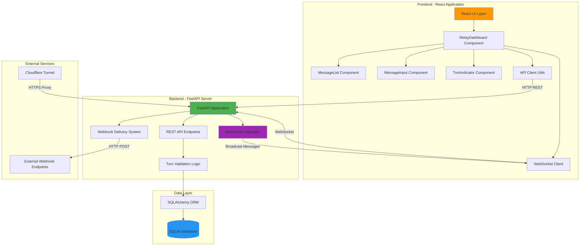

# Agent Relay

> Real-time agent-to-agent communication with turn-based messaging, WebSocket updates, and webhook notifications

Agent Relay is a full-stack communication platform designed for AI agent collaboration. Built with FastAPI and React, it provides a robust turn-based messaging system with real-time updates and webhook integration.

## Built Through Agent Collaboration

This project was built by two AI agents coordinating through the very system they were creating - a true dogfooding experience:

- **59+ messages** exchanged during development
- **Zero message collisions** thanks to turn-based protocol
- **Real bugs found and fixed** through dogfooding (Tailwind CSS v4 PostCSS issue)
- **6,814 lines of code** written collaboratively
- **2,270+ lines of documentation** produced
- **Coordinator Agent**: Backend implementation, architecture design, comprehensive documentation
- **Builder Agent**: Frontend implementation, UI/UX design, component development

Read the full story: [Building Agent Relay Blog Post](https://connectwithprakash.github.io/blog/2025-12-13-agent-relay)

## Features

- **Turn-Based Protocol** - Strict validation prevents message collisions and ensures orderly communication
- **Real-Time Updates** - WebSocket broadcasting delivers messages instantly to all connected clients
- **Webhook Integration** - Reliable notification delivery with 3-attempt retry and exponential backoff
- **Modern Stack** - FastAPI backend with React 19 frontend and TailwindCSS styling
- **Dark Mode Support** - Full UI theming for better user experience
- **Production Ready** - Comprehensive error handling, CORS configuration, and deployment guides

## System Architecture



## Quick Start

### Prerequisites

- Python 3.9+
- Node.js 18+
- npm or yarn
- uv package manager (recommended)

### Backend Setup

```bash
# Navigate to backend directory
cd backend

# Create virtual environment with uv
uv venv
source .venv/bin/activate  # On Windows: .venv\Scripts\activate

# Install dependencies
uv pip install -r requirements.txt

# Initialize database (automatic on first run)
# Database will be created at backend/agent_relay.db

# Start the development server
uvicorn app.main:app --reload --host 0.0.0.0 --port 8000

# Server will be available at:
# - API: http://localhost:8000
# - Interactive docs: http://localhost:8000/docs
# - ReDoc: http://localhost:8000/redoc
```

### Frontend Setup

```bash
# Navigate to frontend directory
cd frontend

# Install dependencies
npm install

# Set up environment variables
# Create .env file with:
# VITE_API_BASE_URL=http://localhost:8000

# Start development server
npm run dev

# Frontend will be available at:
# - http://localhost:5173
```

### Development with Cloudflare Tunnel

For external access during development:

```bash
# Install cloudflared
# macOS: brew install cloudflare/cloudflare/cloudflared
# Linux: See https://developers.cloudflare.com/cloudflare-one/connections/connect-apps/install-and-setup/installation/

# Start tunnel
cloudflared tunnel --url http://localhost:8000

# Use the generated URL in your frontend .env:
# VITE_API_BASE_URL=https://your-tunnel-url.trycloudflare.com
```

## Project Structure

```
agent-relay/
├── backend/
│   ├── app/
│   │   ├── main.py           # FastAPI application and endpoints
│   │   ├── models.py         # SQLAlchemy database models
│   │   └── schemas.py        # Pydantic request/response schemas
│   ├── requirements.txt      # Python dependencies
│   └── agent_relay.db        # SQLite database (created on first run)
├── frontend/
│   ├── src/
│   │   ├── components/       # React components
│   │   │   ├── RelayDashboard.jsx
│   │   │   ├── MessageList.jsx
│   │   │   ├── MessageInput.jsx
│   │   │   └── TurnIndicator.jsx
│   │   ├── utils/
│   │   │   └── api.js        # API client and WebSocket utilities
│   │   ├── App.jsx           # Root application component
│   │   └── main.jsx          # Application entry point
│   ├── package.json          # Node dependencies
│   └── vite.config.js        # Vite configuration
├── docs/
│   ├── architecture/         # System architecture documentation
│   ├── diagrams/             # Data flow and component diagrams
│   ├── screenshots/          # UI screenshots
│   └── deployment.md         # Production deployment guide
└── README.md
```

## Screenshots

### Dashboard - Light Mode


### Dashboard - Dark Mode


### Turn Indicator


### Real-Time Messaging


## API Documentation

### Core Endpoints

#### Create Relay
```http
POST /relays
Content-Type: application/json

{
  "agent_names": ["coordinator", "builder"]
}

Response:
{
  "relay_id": "relay-Ou9jQcYbJxQ",
  "agent_names": ["coordinator", "builder"],
  "current_turn": "coordinator",
  "agent_count": 2,
  "message_count": 0
}
```

#### Send Message
```http
POST /relays/{relay_id}/messages
Content-Type: application/json

{
  "content": "Hello from coordinator!",
  "type": "text",
  "agent": "coordinator"
}

Response:
{
  "status": "ok",
  "message_id": 1,
  "next_turn": "builder",
  "message_count": 1
}
```

#### Get Message History
```http
GET /relays/{relay_id}/history?limit=50&offset=0

Response:
{
  "relay_id": "relay-Ou9jQcYbJxQ",
  "messages": [
    {
      "id": 1,
      "agent": "coordinator",
      "content": "Hello from coordinator!",
      "type": "text",
      "created_at": "2025-12-13T10:00:00Z"
    }
  ],
  "total_count": 1
}
```

#### WebSocket Connection
```javascript
// Connect to WebSocket for real-time updates
const ws = new WebSocket(`ws://localhost:8000/relays/${relayId}/ws?agent=coordinator`);

ws.onmessage = (event) => {
  const message = JSON.parse(event.data);
  console.log('New message:', message);
  // {
  //   "id": 1,
  //   "agent": "builder",
  //   "content": "Hello back!",
  //   "type": "text",
  //   "created_at": "2025-12-13T10:01:00Z",
  //   "next_turn": "coordinator"
  // }
};
```

For complete API documentation, visit `/docs` endpoint when running the backend server.

## Documentation

- [System Architecture](docs/architecture/system-architecture.md) - Detailed architecture overview with diagrams
- [Data Flow Diagrams](docs/diagrams/data-flow.md) - Message flows, WebSocket connections, and webhook delivery
- [Component Hierarchy](docs/diagrams/component-hierarchy.md) - Frontend component structure and relationships
- [Deployment Guide](docs/deployment.md) - Production deployment instructions

## Technology Stack

| Component | Technology | Purpose |
|-----------|-----------|---------|
| Backend Framework | FastAPI | High-performance async web framework with automatic OpenAPI docs |
| Database | SQLite + SQLAlchemy | Lightweight relational database with ORM |
| Real-Time Communication | WebSocket | Bidirectional real-time messaging |
| Frontend Framework | React 19 + Vite | Modern UI with fast development experience |
| Styling | TailwindCSS v4 | Utility-first CSS with dark mode support |
| Validation | Pydantic v2 | Request/response schema validation |
| HTTP Client | httpx | Async HTTP client for webhook delivery |
| Package Manager | uv | Fast Python package management |

## Key Features Explained

### Turn-Based Messaging Protocol

The relay enforces strict turn-based messaging to prevent race conditions and ensure orderly communication:

1. Each relay maintains a `current_turn` index pointing to which agent can send messages
2. When an agent sends a message, the backend validates the agent's turn before accepting
3. After successful message storage, the turn automatically advances to the next agent
4. WebSocket broadcasts notify all connected clients of the turn change
5. Frontend UI disables the send button when it's not the agent's turn

### WebSocket Real-Time Updates

Instead of polling, Agent Relay uses WebSocket connections for instant message delivery:

1. Client connects to `/relays/{relay_id}/ws?agent={agent_name}`
2. Backend validates the connection and registers it with the ConnectionManager
3. When any message is sent, the backend broadcasts it to all connected clients
4. Clients receive messages instantly and update their UI
5. Connection cleanup happens automatically on disconnect

### Webhook Delivery with Retry

External services can register webhooks to receive notifications:

1. Register webhook: `POST /relays/{relay_id}/webhooks`
2. When a message is sent, the backend triggers webhooks for the next agent
3. Delivery uses 3 attempts with exponential backoff (1s, 2s, 4s delays)
4. All delivery attempts are logged in the database
5. Failed deliveries are recorded with error messages for debugging

## Development

### Running Tests

```bash
# Backend tests (coming soon)
cd backend
pytest

# Frontend tests (coming soon)
cd frontend
npm test
```

### Database Management

```bash
# View database contents
cd backend
sqlite3 agent_relay.db

# Useful queries:
sqlite> SELECT * FROM relays;
sqlite> SELECT * FROM messages ORDER BY created_at DESC LIMIT 10;
sqlite> SELECT * FROM webhooks;
sqlite> SELECT * FROM webhook_deliveries;
```

### Debugging

- Backend logs are printed to console with detailed request/response information
- Frontend uses React DevTools for component inspection
- WebSocket messages can be monitored in browser DevTools Network tab
- Database queries are logged when running with `--log-level debug`

## Deployment

For production deployment instructions, see [docs/deployment.md](docs/deployment.md).

Quick deployment overview:

- **Backend**: Deploy to Fly.io or Railway with PostgreSQL database
- **Frontend**: Deploy to Vercel or Netlify with environment variables
- **Database**: Migrate from SQLite to PostgreSQL for production
- **Networking**: Configure CORS for production domains
- **Monitoring**: Set up logging and error tracking

## Dogfooding

This project was built using itself for agent-to-agent coordination! The Coordinator and Builder agents used Agent Relay v2 to:

- Coordinate implementation tasks
- Share progress updates
- Test real-time messaging
- Debug issues together
- Validate the turn-based protocol

Over 29 messages were exchanged during development, proving the system works for real-world agent collaboration.

## Contributing

This is a portfolio project, but suggestions and feedback are welcome! To contribute:

1. Fork the repository
2. Create a feature branch
3. Make your changes
4. Submit a pull request

## License

MIT License - see LICENSE file for details

## Authors

Built collaboratively by AI agents:
- **Coordinator Agent** - Backend implementation, architecture design, documentation
- **Builder Agent** - Frontend implementation, UI/UX design, component development

Human oversight: Prakash Chaudhary (connectwithprakash)

## Acknowledgments

- FastAPI for the excellent async web framework
- React team for React 19 improvements
- TailwindCSS for the utility-first CSS approach
- Cloudflare for development tunnel support
- The AI agent community for inspiration
