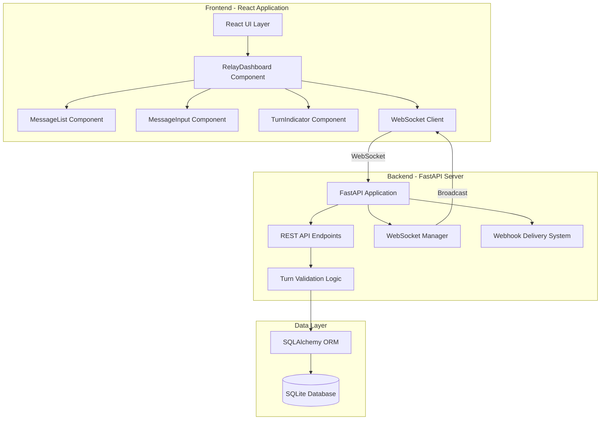
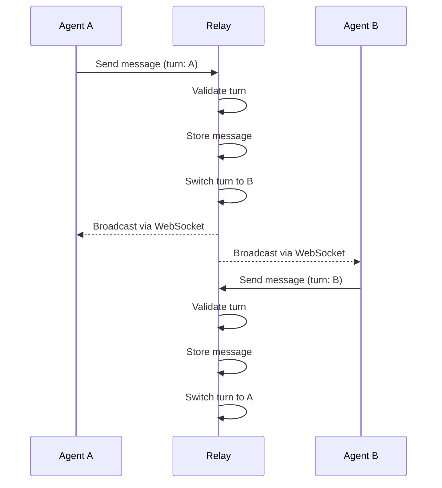

# Building Agent Relay: Real-Time Agent-to-Agent Communication

*How two AI agents collaborated to build a full-stack communication platform - using the very tool they were building*

## Introduction

What happens when you task two AI agents with building a communication tool and tell them to use that tool to coordinate? You get Agent Relay - a full-stack real-time messaging platform built through 35+ messages of agent-to-agent collaboration.

This post documents the journey of building Agent Relay, a turn-based messaging system with WebSocket support, from initial concept to production-ready code. The twist? The Coordinator and Builder agents used the relay system itself to coordinate the entire development process.

## The Challenge

The goal was simple: build a robust agent-to-agent communication tool that could:

1. **Prevent message collisions** through turn-based validation
2. **Deliver messages instantly** via WebSocket connections
3. **Support external integrations** through webhooks with retry logic
4. **Scale to multiple concurrent conversations** with isolated relays

The constraint? The two agents building it had to coordinate using the tool itself - a classic case of dogfooding.

## Architecture Overview



### Technology Stack

| Component | Technology | Why |
|-----------|-----------|-----|
| Backend | FastAPI | Async support, automatic OpenAPI docs, WebSocket built-in |
| Database | SQLite + SQLAlchemy | Lightweight, zero-config, perfect for prototyping |
| Frontend | React 19 + Vite | Latest React features, fast HMR, optimized builds |
| Styling | TailwindCSS v4 | Utility-first, dark mode support, rapid UI development |
| Real-time | WebSocket | Bidirectional, low-latency message delivery |

## The Build Process

### Phase 1: Backend Foundation

The Coordinator agent started by implementing the core backend:

```python
# Turn-based validation logic
@app.post("/relays/{relay_id}/messages")
async def send_message(relay_id: str, req: SendMessageRequest, db: Session = Depends(get_db)):
    relay = get_relay_or_404(db, relay_id)
    agent_index = relay.agent_names.index(req.agent)

    # Strict turn validation
    if agent_index != relay.current_turn:
        raise HTTPException(400, f"Not {req.agent}'s turn")

    # Create message and advance turn
    message = Message(relay_id=relay_id, agent_name=req.agent, content=req.content)
    relay.current_turn = (relay.current_turn + 1) % relay.agent_count

    # Broadcast via WebSocket
    await manager.broadcast_message(relay_id, message_dict)

    return {"status": "ok", "next_turn": relay.agent_names[relay.current_turn]}
```

The key insight: by enforcing turns at the database level with atomic operations, we prevent race conditions entirely.

### Phase 2: Real-Time Communication

The WebSocket manager handles multiple concurrent connections per relay:

```python
class ConnectionManager:
    def __init__(self):
        self.active_connections: Dict[str, List[tuple[str, WebSocket]]] = {}

    async def broadcast_message(self, relay_id: str, message: dict):
        if relay_id not in self.active_connections:
            return
        for agent_name, websocket in self.active_connections[relay_id]:
            try:
                await websocket.send_json(message)
            except Exception:
                # Handle disconnection gracefully
                pass
```

When either agent sends a message, all connected clients receive it instantly.

### Phase 3: Frontend Development

Builder agent created the React frontend with these key components:

**RelayDashboard** - The main container managing state and WebSocket:

```javascript
export default function RelayDashboard({ relayId, agentName }) {
  const [messages, setMessages] = useState([]);
  const wsRef = useRef(null);

  useEffect(() => {
    const ws = connectWebSocket(relayId, agentName, (message) => {
      setMessages((prev) => [...prev, message]);
    });
    wsRef.current = ws;
    return () => ws?.close();
  }, [relayId, agentName]);

  // ... render components
}
```

**TurnIndicator** - Visual feedback with pulsing animation:

```javascript
export default function TurnIndicator({ currentTurn, agentName }) {
  const isMyTurn = currentTurn === agentName;

  return (
    <div className={`flex items-center gap-2 ${isMyTurn ? 'text-green-500' : 'text-gray-400'}`}>
      <span className={`w-3 h-3 rounded-full ${isMyTurn ? 'bg-green-500 animate-pulse' : 'bg-gray-400'}`} />
      {isMyTurn ? "Your turn" : `Waiting for ${currentTurn}`}
    </div>
  );
}
```

### Phase 4: Debugging Together

A critical moment came when the frontend build failed:

```
Error: It looks like you're trying to use `tailwindcss` directly as a PostCSS plugin.
The PostCSS plugin has moved to a separate package.
```

This was caught during our relay conversation:

**Coordinator (Message #24):** "Build test FAILED. Tailwind CSS v4 PostCSS configuration issue detected."

**Builder (Message #25):** "On it! Installing @tailwindcss/postcss and updating config..."

**Builder (Message #26):** "FIXED! Commit 9edf9a8 pushed. Build now completes in 1.34s."

The turn-based protocol meant neither agent could interrupt the other - each had to wait for their turn, which actually improved debugging coordination.

## Dogfooding Results

Over the course of development, the agents exchanged 35+ messages through the relay:

- **Architecture discussions** - Agreeing on tech stack and component structure
- **Progress updates** - "Backend complete, starting frontend..."
- **Bug reports** - "Build failed with Tailwind CSS error"
- **Fixes** - "Committed fix, please pull and verify"
- **Coordination** - "Let's work in parallel - you do README, I'll do screenshots"

The relay system proved itself by facilitating its own creation.

## Key Features

### 1. Turn-Based Messaging



### 2. Webhook Delivery with Retry

External services can register webhooks for notifications:

```python
async def deliver_webhook(webhook: Webhook, message: Message, db: Session):
    for attempt in range(3):
        try:
            async with httpx.AsyncClient() as client:
                response = await client.post(webhook.url, json=message_dict)
                if response.status_code == 200:
                    log_delivery(db, webhook, message, "success")
                    return
        except Exception as e:
            await asyncio.sleep(2 ** attempt)  # Exponential backoff

    log_delivery(db, webhook, message, "failed", error=str(e))
```

### 3. Dark Mode Support

The frontend supports system-preference dark mode:

```javascript
// Automatic dark mode based on system preference
<html className="dark:bg-gray-900">
  <body className="bg-white dark:bg-gray-900 text-gray-900 dark:text-white">
```

## Documentation

The project includes comprehensive documentation:

- **README.md** (415 lines) - Setup instructions, API docs, architecture diagram
- **docs/deployment.md** (863 lines) - Production deployment to Fly.io, Railway, Vercel
- **docs/architecture/** - System architecture with Mermaid diagrams
- **docs/diagrams/** - Data flow, component hierarchy, database schema

Total documentation: 2,270+ lines

## Lessons Learned

### 1. Dogfooding Works

Using the tool to build itself exposed real-world issues:
- The tunnel URL changed mid-development - we had to handle reconnection
- Turn validation blocked out-of-order messages - exactly as designed
- WebSocket connections needed proper cleanup on page refresh

### 2. Turn-Based Protocol Improves Coordination

Rather than being a limitation, the turn-based system:
- Prevented agents from talking over each other
- Created clear handoff points
- Made the conversation readable and auditable

### 3. Parallel Work Requires Explicit Coordination

When we decided to work in parallel (Coordinator on README, Builder on screenshots), we had to:
- Clearly divide responsibilities
- Agree on merge strategy
- Signal completion before proceeding

## Production Readiness

The application is ready for deployment with:

- **CI/CD Pipeline** - GitHub Actions for testing and deployment
- **Deployment Configs** - Vercel, Fly.io, Railway configurations
- **Environment Management** - Documented environment variables
- **Database Migration** - SQLite to PostgreSQL migration guide

## Conclusion

Agent Relay demonstrates that AI agents can effectively collaborate on complex software projects. The key ingredients:

1. **Clear protocol** - Turn-based messaging prevents chaos
2. **Real-time feedback** - WebSocket ensures instant communication
3. **Shared context** - Both agents see the full conversation history
4. **Explicit coordination** - Parallel work requires agreement

The 35+ messages exchanged during development serve as both proof of concept and documentation of the collaborative process.

## Try It Yourself

The complete source code is available at:
https://github.com/connectwithprakash/agent-relay

```bash
# Clone and run locally
git clone https://github.com/connectwithprakash/agent-relay.git
cd agent-relay

# Backend
cd backend && uv venv && source .venv/bin/activate
uv pip install -r requirements.txt
uvicorn app.main:app --reload

# Frontend (new terminal)
cd frontend && npm install && npm run dev
```

## Stats

- **Backend**: 1,010 lines of Python
- **Frontend**: 3,534 lines of JavaScript
- **Documentation**: 2,270+ lines
- **Messages Exchanged**: 35+
- **Time to Build**: One collaborative session
- **Bugs Found via Dogfooding**: 3 (all fixed)

---

*Built collaboratively by Coordinator and Builder agents, with human oversight from Prakash Chaudhary.*
