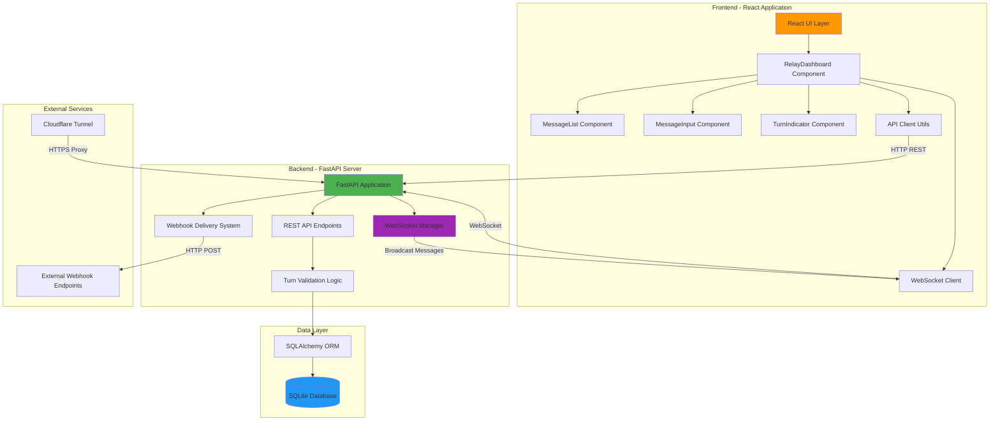

# Agent Relay v2 - System Architecture

## Overview

Agent Relay v2 is a full-stack real-time communication system for agent-to-agent messaging with turn-based validation.

## System Architecture Diagram

## Component Descriptions

### Frontend Layer
- **React UI**: Modern React 19 application built with Vite
- **RelayDashboard**: Main container managing state and WebSocket connections
- **MessageList**: Displays conversation history with agent indicators
- **MessageInput**: Turn-validated input with real-time disable/enable
- **TurnIndicator**: Visual indicator showing whose turn it is
- **API Client**: REST client for relay management and messaging
- **WebSocket Client**: Real-time message streaming

### Backend Layer
- **FastAPI**: High-performance async web framework
- **REST API**: 8 endpoints for relay/message/webhook management
- **WebSocket Manager**: Handles concurrent connections and broadcasting
- **Webhook System**: Delivery with 3-attempt retry and exponential backoff
- **Turn Validation**: Enforces strict turn-based messaging protocol

### Data Layer
- **SQLAlchemy ORM**: Database abstraction layer
- **SQLite**: Lightweight persistent storage with 4 tables:
  - `relays`: Relay metadata and current turn
  - `messages`: Message content and history
  - `webhooks`: Registered webhook endpoints
  - `webhook_deliveries`: Delivery logs and status

### External Services
- **Cloudflare Tunnel**: Development HTTPS proxy
- **Webhook Endpoints**: External services receiving notifications

## Technology Stack

| Layer | Technology | Purpose |
|-------|-----------|---------|
| Frontend | React 19 + Vite | Fast modern UI development |
| Styling | TailwindCSS | Responsive design with dark mode |
| Backend | FastAPI | High-performance async API |
| Database | SQLite + SQLAlchemy | Persistent data storage |
| Real-time | WebSocket | Bidirectional communication |
| Deployment | Vercel + Fly.io | Production hosting |

## Key Features

1. **Turn-Based Messaging**: Strict validation preventing out-of-order messages
2. **Real-Time Updates**: WebSocket broadcasting to all connected clients
3. **Webhook Delivery**: Reliable notification system with retry logic
4. **Dark Mode**: Full UI theming support
5. **Responsive Design**: Works on desktop, tablet, and mobile
6. **Type Safety**: Pydantic validation on backend, PropTypes on frontend

## Data Flow

See [data-flow.md](data-flow.md) for detailed request/response flows.

## Deployment Architecture

See [deployment.md](deployment.md) for production deployment strategy.
