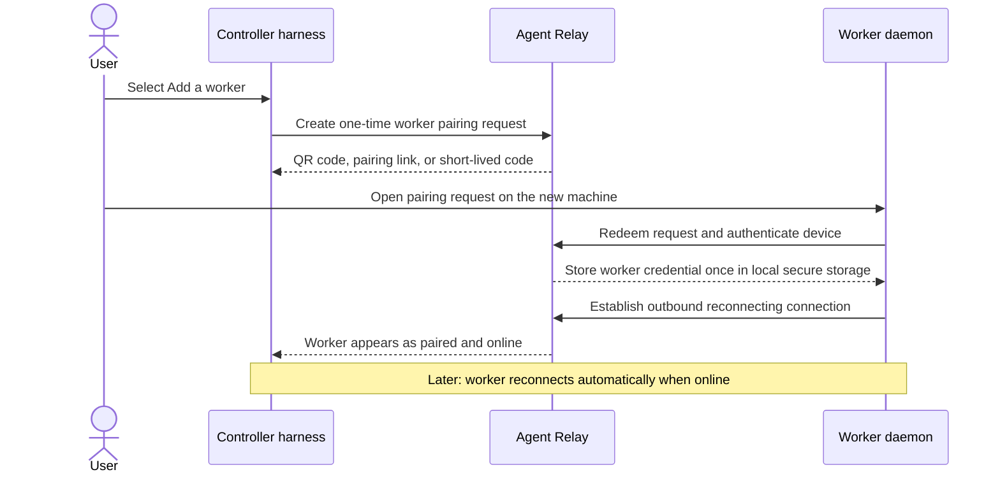
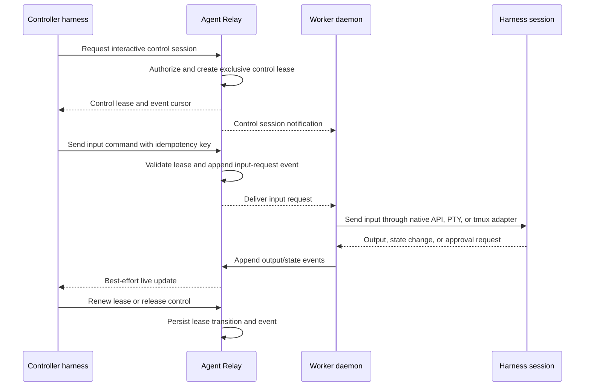
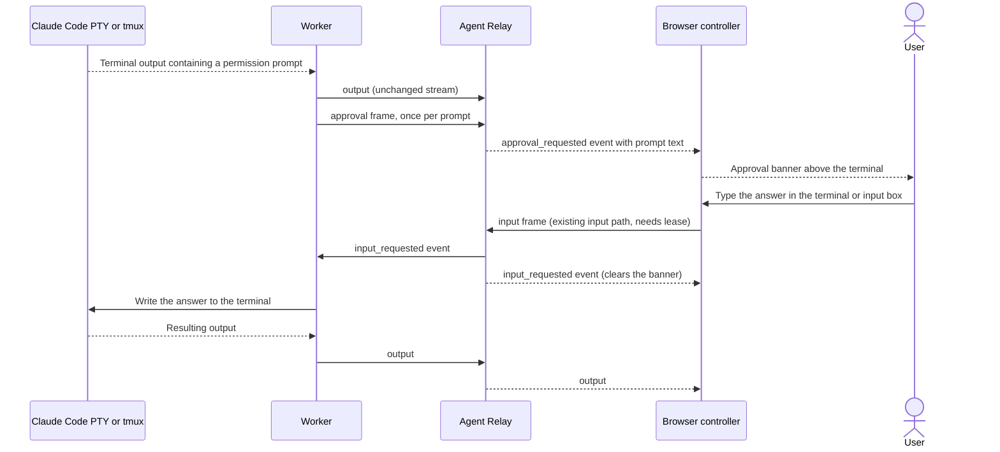
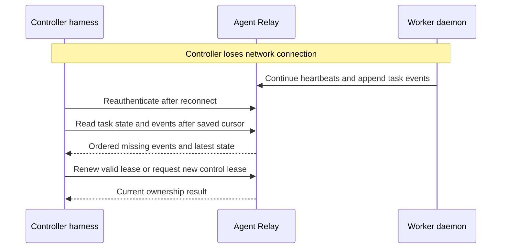
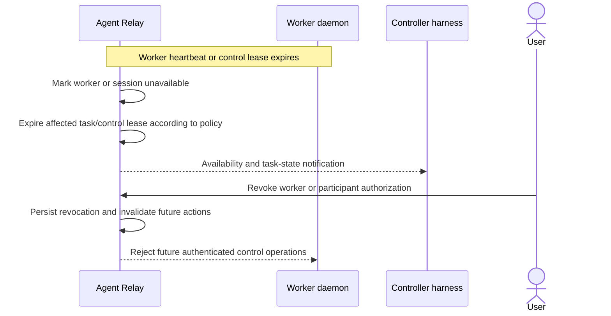

# Cross-Harness Control: User Flows and Sequences

**Status:** Behavior proposal for review
**Companion:** `docs/cross-harness-control-architecture.md`

## Why this document exists

The architecture names the components. These flows define the user-visible contract between a controller harness, Agent Relay, a worker daemon, and a local harness runtime.

```text
Architecture answers: what runs where?

User flows answer: what can a user or controller actually do?

Sequence diagrams answer: who owns each state transition over time?
```

## Flow map

```text
Pair worker
  → discover worker and capabilities
    → choose task mode or interactive mode
      → run or control a harness session
        → observe events and artifacts
          → recover after interruption or finish cleanly
```

---

## 1. Pair once and remember a worker

### User goal

Add a personal machine once, then have it reconnect and appear automatically whenever it is online—like a remembered Wi-Fi network. The user should never need to remember an IP address, SSH destination, tmux session name, or reusable invitation secret.



### Contract

- Pairing requires explicit approval on the machine being added.
- The worker stores a revocable device credential in the OS keychain or an owner-only local credential store.
- Subsequent connections are automatic outbound reconnects; no public inbound port, repeated pairing, or manual address entry is required.
- A remembered worker appears in the controller directory with current availability, capabilities, projects, and sessions.
- Pairing establishes durable identity and trust only. It does not grant unrestricted shell access or permanent interactive-control authority.
- The owner can forget or revoke a worker, which prevents future reconnection and control requests.

---

## 2. Submit a bounded task to a managed harness session

### User goal

Ask a remote harness to perform a defined unit of work and receive durable progress and evidence.

```mermaid
sequenceDiagram
    participant C as Controller harness
    participant R as Agent Relay
    participant W as Worker daemon
    participant H as Managed harness session

    C->>R: Create task with idempotency key and expected version
    R->>R: Authorize, append task-created event, persist task
    R-->>C: Task accepted with task ID and event cursor
    R-->>W: Post-commit notification
    W->>R: Claim task lease
    R->>R: Validate state and lease; append claimed event
    R-->>W: Lease granted
    W->>H: Start bounded allowed operation
    H-->>W: Progress and structured result
    W->>R: Append ordered progress events and artifact reference
    W->>R: Complete task with final event
    R-->>C: Live notification; durable event read remains available
    C->>R: Read task and events after cursor
    R-->>C: Complete timeline and artifact reference
```

### Contract

- Retrying the same create request returns the original task, never a second run.
- The worker must claim a lease before it starts the operation.
- Progress is useful live feedback; ordered persisted events are recovery truth.
- The task result includes a structured artifact reference, not only prose.

---

## 3. Attach to and interact with a harness session

### User goal

Take temporary, exclusive control of a remote Claude Code, Codex, Hermes, or tmux-backed session while preserving a durable audit trail.



### Contract

- At most one controller holds interactive input ownership at a time.
- Observers may have read access without input authority when policy allows.
- Native adapters, managed PTY, and adopted tmux sessions expose the same public control contract, but report their adapter-specific guarantee level.
- Releasing a lease does not stop the harness unless the controller requests stop and policy permits it.

---

## 4. Respond to an approval request

### User goal

A remote harness pauses safely when it needs permission, and the authorized controller or human can see the exact prompt and answer it from the live control page.



### Contract

- Detection belongs to the worker. It matches known Claude Code permission prompts, reports each prompt once, and never alters the `output` stream.
- The prompt is a non-empty string of at most 4096 bytes. The browser renders it as plain text and ignores any other payload.
- There is no approve or reject frame. The controller answers with ordinary `input`, so only the holder of an active lease can respond.
- The banner clears when the user dismisses it, when a newer approval arrives, when the user sends input from the page, or when a later `input_requested` event is seen. Terminal redraws such as spinners do not clear it, and a replay that ends with `input_requested` leaves no stale banner.
- The text of an `input_requested` event is never displayed or echoed into the terminal by the browser.

---

## 5. Recover after controller or network interruption

### User goal

Resume trustworthy supervision without re-running work or guessing what happened while disconnected.



### Contract

- WebSocket or SSE loss is never interpreted as task failure or completion.
- The controller reconciles from durable state plus events after its last cursor.
- A controller that cannot renew an expired lease must obtain a new one; it cannot resume input authority implicitly.
- A worker restart produces a visible recovering, failed, or reattached session state—not a fabricated success.

---

## 6. Recover or revoke a worker/session safely

### User goal

Respond safely when a worker disappears, a session becomes unhealthy, or the owner revokes access.



### Contract

- Expiry and revocation are service-owned state transitions, never inferred from a missing live stream alone.
- Existing local harness processes are not killed automatically unless an explicit policy says they should be.
- The audit trail distinguishes offline, lease-expired, revoked, cancelled, and failed.

---

## Cross-flow acceptance questions

Before treating the product as complete, every flow must answer:

| Question | Required answer |
|---|---|
| Who is authenticated? | Participant, worker, and controller identities are explicit. |
| Who may act? | The relay and local worker policy both authorize the operation. |
| Who owns interactive input? | A time-bounded exclusive control lease. |
| What survives reconnect? | Persisted state, ordered events, artifacts, and lease truth. |
| What is best effort? | Live WebSocket/SSE delivery only. |
| What proves completion? | A terminal event plus observable artifact or execution result. |
| What happens on failure? | Explicit failed, cancelled, paused, or recoverable state with reason. |
| What is never exposed? | Secrets, unrestricted shell access, and unauthorized project content. |
