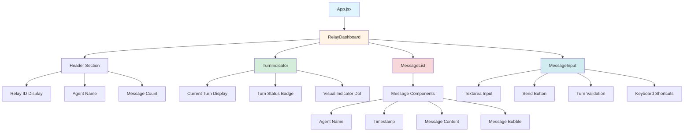
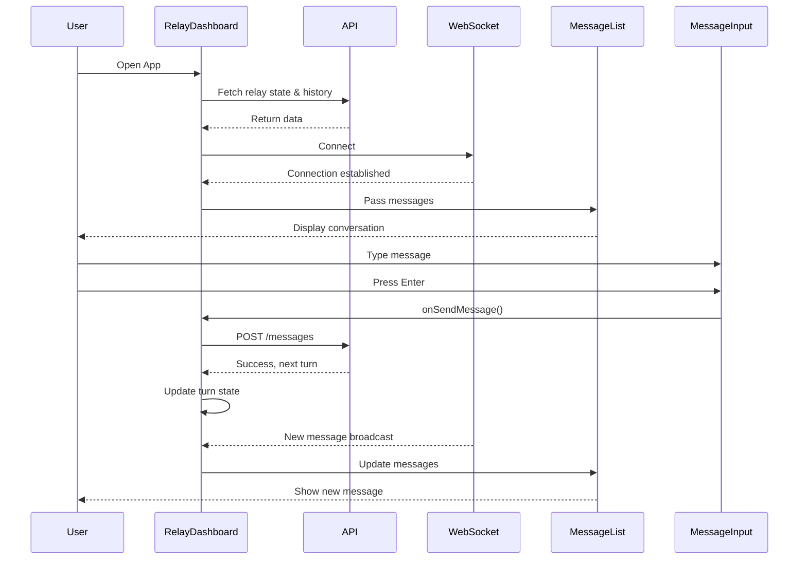

# Frontend Component Hierarchy

## Component Tree Structure

## Component Details

### App Component
- **File**: `src/App.jsx`
- **Purpose**: Root application component
- **State**: None (stateless)
- **Props**: None
- **Key Features**:
  - Hardcoded relay configuration (relay ID, agent name)
  - Renders RelayDashboard component
  - Global CSS imports

### RelayDashboard Component
- **File**: `src/components/RelayDashboard.jsx`
- **Purpose**: Main container and orchestrator
- **State**:
  - `relay`: Current relay state object
  - `messages`: Array of message objects
  - `loading`: Boolean for initial load
  - `error`: Error message string
- **Props**:
  - `relayId`: String - Relay identifier
  - `agentName`: String - Current agent name
- **Key Features**:
  - Fetches relay state and message history on mount
  - Manages WebSocket connection lifecycle
  - Handles message sending
  - Provides layout structure (header, body, input)

### TurnIndicator Component
- **File**: `src/components/TurnIndicator.jsx`
- **Purpose**: Visual turn status display
- **State**: None (pure component)
- **Props**:
  - `currentTurn`: String - Which agent's turn it is
  - `agentName`: String - Current user's agent name
- **Key Features**:
  - Green pulsing dot when it's your turn
  - Gray dot when waiting
  - "Your Turn" or "Waiting..." badge
  - Responsive design with dark mode

### MessageList Component
- **File**: `src/components/MessageList.jsx`
- **Purpose**: Display conversation history
- **State**: None (pure component)
- **Props**:
  - `messages`: Array - List of message objects
  - `currentAgent`: String - Current user's agent name
- **Key Features**:
  - Auto-scroll to latest message
  - Chat-style bubble layout
  - Different styling for own vs other messages
  - Timestamp formatting
  - Agent name display
  - Empty state handling
  - Dark mode support

### MessageInput Component
- **File**: `src/components/MessageInput.jsx`
- **Purpose**: Message composition and sending
- **State**:
  - `message`: String - Current input text
  - `sending`: Boolean - Send in progress
- **Props**:
  - `onSendMessage`: Function - Send handler
  - `currentTurn`: String - Whose turn it is
  - `agentName`: String - Current agent name
  - `disabled`: Boolean - External disable flag
- **Key Features**:
  - Turn-based validation
  - Keyboard shortcuts (Enter to send, Shift+Enter for newline)
  - Loading state during send
  - Conditional placeholder text
  - Error handling with alerts
  - Disabled state when not your turn

## Data Flow

## State Management

### Local Component State
- Each component manages its own UI state
- No global state management (Redux, Context)
- Props drilling for shared data
- WebSocket ref stored in RelayDashboard

### Data Fetching Strategy
- Initial load: Parallel fetch of relay state + message history
- Real-time updates: WebSocket push
- Message send: REST API POST
- No caching or persistence (fresh data on reload)

## Styling Approach

### Tailwind CSS Utility Classes
- Responsive design with mobile-first approach
- Dark mode using `dark:` prefix
- Component-scoped styles
- No CSS modules or styled-components

### Design System
- **Colors**:
  - Blue (`bg-blue-500`) for primary actions and own messages
  - Gray (`bg-gray-200`) for other messages
  - Green (`bg-green-500`) for active turn indicator
  - Red for errors
- **Spacing**: Consistent padding/margin scale (p-2, p-4, etc.)
- **Typography**: System fonts with good readability

## Key Architectural Decisions

1. **Monolithic Dashboard Component**: RelayDashboard handles both data fetching and WebSocket management for simplicity
2. **Pure Presentational Components**: TurnIndicator, MessageList, MessageInput receive all data via props
3. **WebSocket in Parent**: Connection managed at top level to avoid reconnection on re-renders
4. **No Abstraction for API Calls**: Simple fetch wrappers in `utils/api.js`
5. **Turn Validation at UI Level**: Prevents unnecessary API calls for invalid actions

## Future Enhancements

- [ ] Extract WebSocket logic into custom hook (`useWebSocket`)
- [ ] Add global state management for multi-relay support
- [ ] Implement message caching/persistence
- [ ] Add optimistic UI updates
- [ ] Create reusable design system components
- [ ] Add unit tests for each component
- [ ] Implement error boundaries
- [ ] Add loading skeletons
