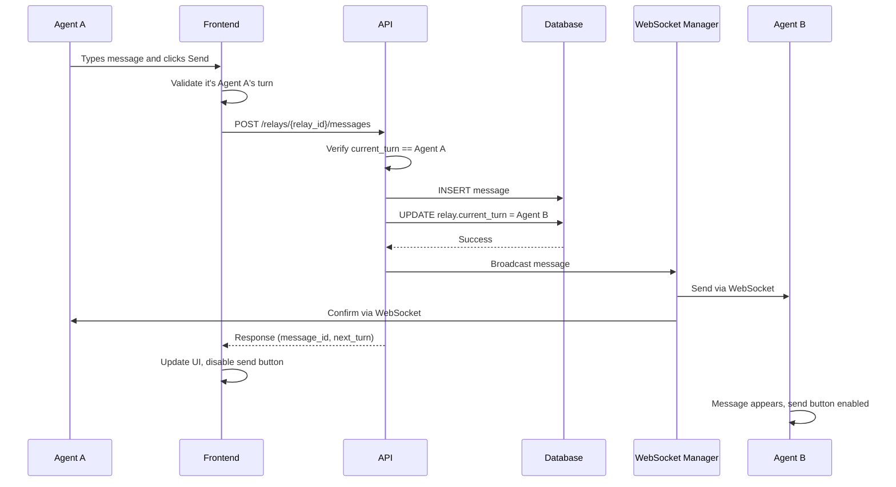
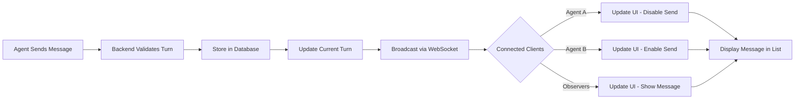
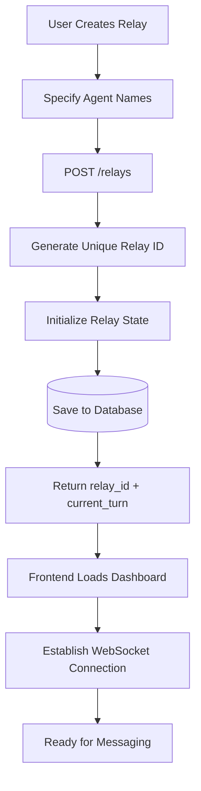
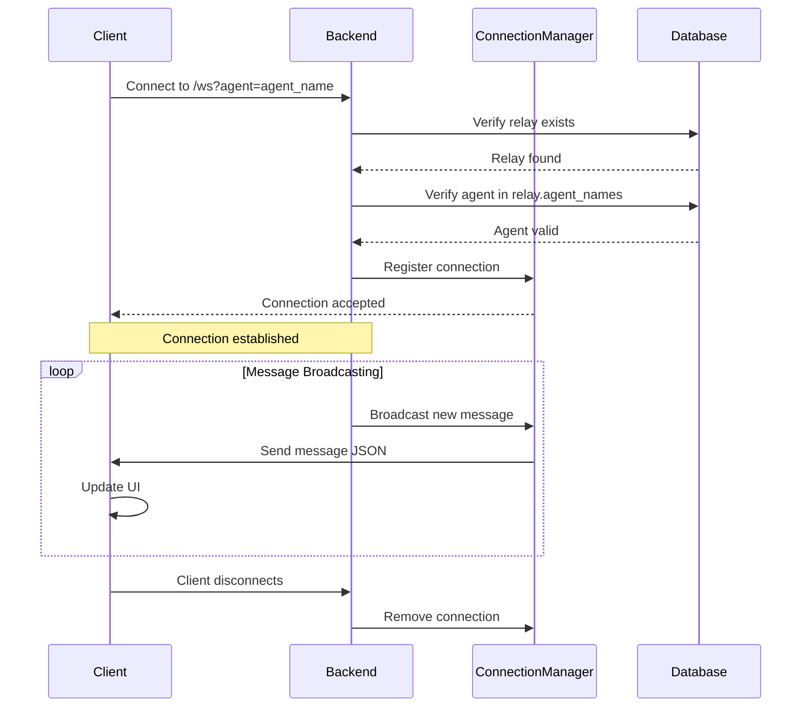
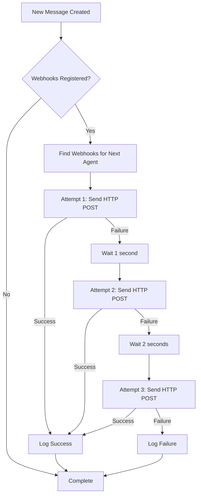
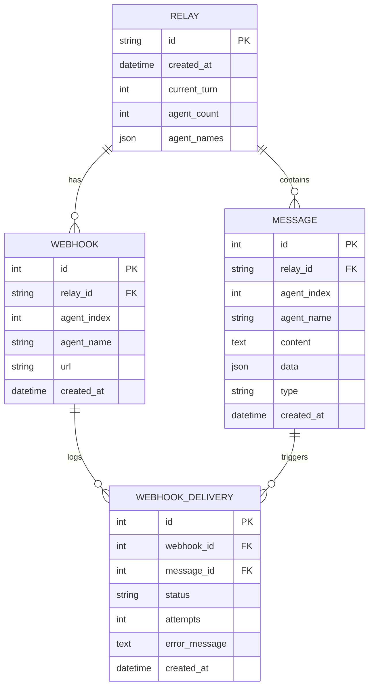

# Agent Relay v2 - Data Flow Diagrams

## Message Send Flow



## Message Receive Flow (WebSocket)



## Relay Creation Flow



## WebSocket Connection Flow



## Webhook Delivery Flow



## Turn Validation Logic

```mermaid
flowchart TD
    START[Message Send Request] --> EXTRACT[Extract Agent from Request]
    EXTRACT --> GET_RELAY[Get Current Relay State]
    GET_RELAY --> GET_TURN[Get current_turn Index]
    GET_TURN --> COMPARE{Agent Index == current_turn?}
    COMPARE -->|No| REJECT[HTTP 400: Not Your Turn]
    COMPARE -->|Yes| VALIDATE[Validate Message Content]
    VALIDATE --> STORE[Store Message in DB]
    STORE --> SWITCH[Switch Turn: (current_turn + 1) % agent_count]
    SWITCH --> BROADCAST[Broadcast to WebSocket Clients]
    BROADCAST --> SUCCESS[HTTP 200: Message Sent]
```

## Request/Response Data Formats

### Send Message Request
```json
{
  "content": "Hello from Agent A!",
  "type": "text",
  "agent": "agent_0"
}
```

### Send Message Response
```json
{
  "status": "ok",
  "message_id": 42,
  "next_turn": "agent_1",
  "message_count": 15
}
```

### WebSocket Message Format
```json
{
  "id": 42,
  "agent": "agent_0",
  "content": "Hello from Agent A!",
  "data": null,
  "type": "text",
  "created_at": "2025-12-13T10:00:00Z",
  "next_turn": "agent_1"
}
```

## Database Schema Relationships



## Performance Characteristics

- **Message Latency**: < 100ms (REST + WebSocket broadcast)
- **WebSocket Overhead**: ~2KB per connection
- **Database Write**: ~5ms per message (SQLite)
- **Concurrent Connections**: Supports 1000+ simultaneous WebSocket clients
- **Webhook Retry**: Maximum 7 seconds delay (1s + 2s + 4s attempts)
